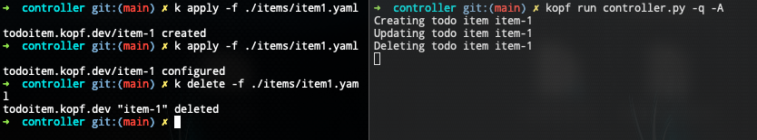
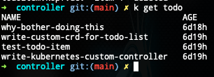
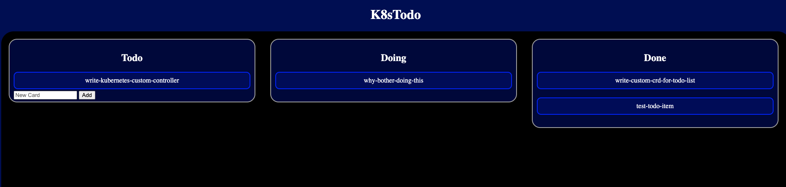

# k8s_todo
Custom kubernetes controller and CRDs along with a Python Flask app for a fancy todo list

## Prereqs
```
python3 -m pip install Flask kopf kubernetes
git clone git@github.com:HeyyMrDJ/k8s_todo.git
cd k8s_todo
```

## Install CRDs and bring up controller
```
cd controller
kubectl apply -f crd.yaml
kopf run controller.py -q -A
```

## Create first item
```
kubectl apply -f ./items/item1.yaml
```

## Modify item manifest and reapply
Edit the manifest annotation lane from todo to doing. Then reapply

```
kubectl apply -f ./items/item1.yaml
```

## Delete item
```
kubectl delete -f ./items/item1.yaml
```

## Bring up Flask app
```
cd ..
cd webapp
flask run
```

## Images



